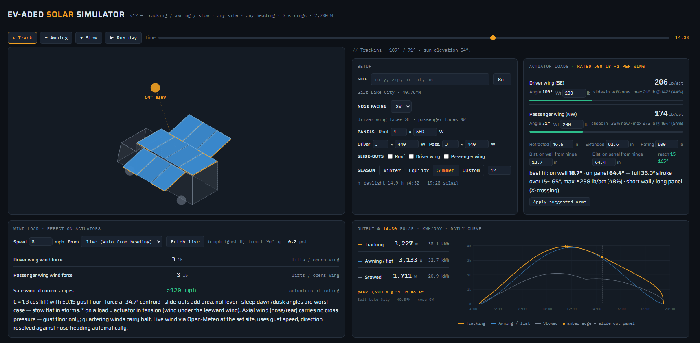

# Evaded Solar Simulator

Interactive simulator for a van-mounted, sun-tracking solar array with deployable wings and fore/aft slide-out panels. Built for the Evaded mobile solar platform.

**Live demo:** https://YOUR-USERNAME.github.io/evaded-solar-simulator/

## What it models

A delivery-van solar system with three surfaces and seven independent strings:

| Surface | Stationary panels (default) | Slide-outs | Motion |
|---|---|---|---|
| Roof | 4 × 550 W, fixed flat | 2 × 550 W | Slide fore/aft along the van, front extending over the cab |
| Driver wing | 3 × 440 W portrait | 2 × 440 W | Hinged at the roofline, 15°–165° single-axis sun tracking; slide-outs extend fore/aft in the same parallel row |
| Passenger wing | 3 × 440 W portrait | 2 × 440 W | Mirror of the driver wing, independently tracked |

Default total: 7,700 W across 14 panels. Counts and per-panel wattages are adjustable per surface in the UI.

## Features

- **Three operating modes** — sun tracking, awning (wings locked flat into one 180° plane with the roof), and stowed (driving configuration)
- **Deploy/stow interlock sequencing** — wings rise before slide-outs extend; slide-outs retract before wings fold
- **Independent slide-out control** for roof, driver wing, and passenger wing
- **Any site** — enter a city, zip code, or raw `lat, lon` coordinates (coordinates work fully offline; city/zip lookup uses the free Open-Meteo geocoder)
- **Any parking heading** — N through NW nose direction with full azimuth geometry; the tool shows how much energy a bad parking orientation costs
- **Seasonal sun model** — winter solstice / equinox / summer solstice with real declination, day length, and solar elevation
- **Live actuator loads** — per-wing, per-actuator load against the 500 lb rating, with user-set wing weights
- **Output comparison** — instantaneous watts and daily kWh for tracking vs. flat vs. stowed, drawn as a background chart behind the simulation with the expected daily peak labeled
- **Run day animation** — sweeps sunrise to sunset while every readout updates live

## How to use

1. **Set your site.** Type a city, zip, or `40.76, -111.89`-style coordinates and hit Set.
2. **Pick the nose heading.** Nose N or S points the wings east–west for the full tracking sweep. Nose E or W faces the wings north–south and the tracking advantage collapses — the tool quantifies exactly how much.
3. **Configure hardware.** Stationary panel count and per-panel wattage for each surface (each surface always carries 2 slide-outs at the same wattage), plus each wing's weight for the actuator load model.
4. **Operate it.** Track / Awning / Stow buttons, slide-out checkboxes (they queue while stowed and extend automatically after deploy), time slider or Run day.
5. **Read the results.** Peak output in the sky readout, actuator loads and angles on the right, W and kWh/day for all three modes, and the daily curves behind the van.

## Physics model

- **Sun position:** site latitude, seasonal declination ±23.44°, hour angle, full azimuth — solar time throughout.
- **Tracking:** the sun vector is projected onto the wing cross-plane for the chosen van heading. Tracked output includes the out-of-plane cosine loss along the van's axis that a single-axis tracker cannot recover.
- **Irradiance:** clear sky, air-mass approximation `sin(elev)^0.3`, 0.85 system derate.
- **Actuator load:** `T = W · r_cg · sin θ` with r_cg = 34.7" and two actuators per wing at a 24" effective arm. Fore/aft slide-outs travel along the hinge axis, so they do not change the cg depth — actuator load is independent of slide state; the cantilever loads transfer to the end hinges and slide rails instead.

## Running locally

No build step. Download `index.html` and open it in any browser. Everything except city/zip geocoding works offline.

## License

MIT — see [LICENSE](LICENSE).
